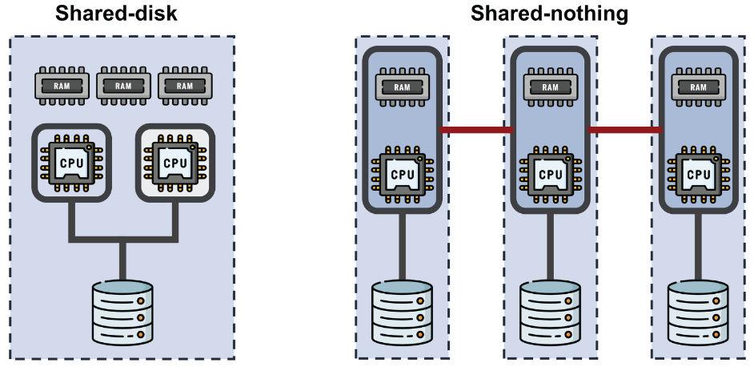
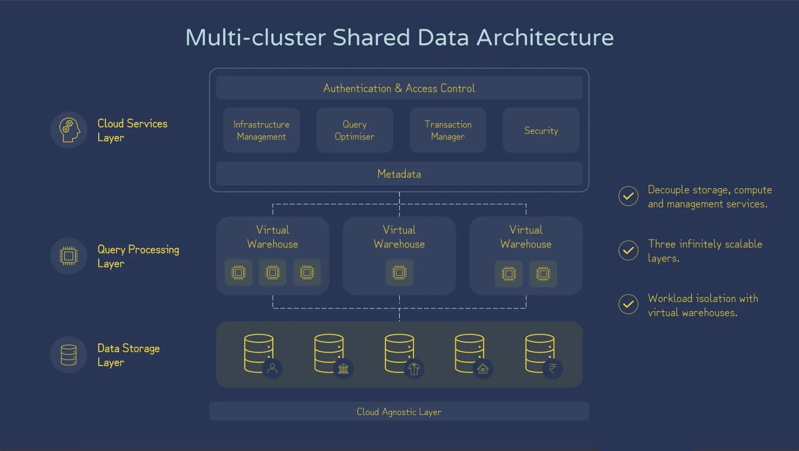

# Snowflake Features & Architecture

This reference covers key concepts about Snowflake’s architecture, objects, and features. It highlights Snowflake’s **cloud-native** design, how storage/compute/services are decoupled, and the many schema-level objects and features (tables, views, tasks, streams, UDFs, etc.) essential for the SnowPro Core Certification.

---

## 1. Introduction to Snowflake

- **Definition**  
  Snowflake is often described as a *cloud-native data platform* offered *as-a-service*. It goes beyond a traditional data warehouse by supporting multiple workloads:
    - **Data Warehousing** (ANSI SQL, ACID transactions, structured/semi-structured data)
    - **Data Lake**–like functionality (handling big data, loading raw files, natively processing JSON, Avro, Parquet, etc.)
    - **Data Engineering** (COPY statement, Snowpipe for streaming/batch ingestion, tasks, streams)
    - **Data Science** (centralized storage, partner integrations with SageMaker, DataRobot, etc.)
    - **Data Sharing** (secure data sharing between Snowflake accounts, data marketplace)
    - **Data Application Development** (connectors/drivers for Python, Java, .NET, plus UDFs, stored procedures, Snowpark)

- **Cloud-Native & SaaS**
    - **Cloud-Native**
        - Purpose-built for AWS, later ported to Azure and GCP.
        - Leverages cloud advantages: high availability, elasticity, near-infinite scalability, durability, etc.
    - **Software as a Service (SaaS)**
        - No infrastructure management or manual patching/upgrades.
        - Pay only for what you use via a flexible, consumption-based model.
        - Automatic data optimization (no manual partitioning/indexing).

---

## 2. Traditional Architectures vs. Snowflake

### 2.1 Shared-Disk vs. Shared-Nothing

- **Shared-Disk Architecture**
    - All compute nodes share access to a **centralized disk/storage system**.
    - **Resources like memory and CPU are also shared or tightly coupled**, requiring constant coordination (e.g., locking, cache synchronization).
    - This tight coupling can lead to **contention and performance bottlenecks**, especially under high concurrency.
    - Suitable for **traditional clustered systems** (e.g., Oracle RAC), but **less ideal for elastic, cloud-native environments** due to limited scalability and complex coordination.

- **Shared-Nothing Architecture**
    - Each node has its own **local storage, CPU, and memory** — no shared components.
    - Enables **cheap horizontal scaling** and **high parallelism**, using **commodity hardware**.
    - However, **storage and compute are tightly coupled** — scaling compute requires scaling storage too.
    - Also, complex queries may require **data shuffling across nodes**, which can introduce overhead.
    - Common in distributed processing frameworks like **Apache Hadoop**, **Apache Spark**, **Presto**, and **Trino**.




### 2.2 Snowflake’s Multi-Cluster Shared Data Architecture

Snowflake does **not follow a pure shared-nothing architecture**. Instead, it adopts a **hybrid approach**:



- **Shared-disk for storage**: all compute nodes access the same centralized data storage.
- **Shared-nothing for compute**: each virtual warehouse is an independent cluster with no shared memory or CPU.

- **Three-layer Architecture**
    1. **Storage Layer** (centralized, columnar, micro-partitioned, encrypted).
    2. **Query Processing Layer** (virtual warehouses, each an isolated cluster).
    3. **Services Layer** (global services for authentication, metadata, transaction mgmt, query optimization, etc.).

- **Layer Characteristics**
    - **Storage**
        - Physically in blob storage (S3, Azure Blob, or GCS) with near-infinite scalability.
        - Columns stored in a proprietary compressed columnar format.
        - Automatic encryption, micro-partitioning, data replication for durability.
    - **Compute (Virtual Warehouses)**
        - Ephemeral clusters you create/resize/pause/resume on demand.
        - Each warehouse is independent, preventing resource contention.
        - Uses local SSD caching for faster repeated queries.
    - **Services**
        - Globally shared services coordinate user/auth, infra provisioning, query parse/optimize, metadata management, transaction mgmt.
        - No infrastructure maintenance required from the user.

- **Decoupled, On-Demand**
    - Enables independent scaling of storage and compute.
    - Supports massive concurrency via multiple virtual warehouses.
    - Delivered as a fully managed SaaS: no OS or cluster maintenance needed.
  


### 🆚 Shared-Disk vs. Shared-Data (Snowflake)

| Feature                  | Shared-Disk                      | Shared-Data (Snowflake)               |
|--------------------------|----------------------------------|----------------------------------------|
| Storage Access           | Shared local disk                | Shared cloud storage (e.g., S3)        |
| Compute                  | Tightly coupled                  | Fully isolated (virtual warehouses)    |
| Coordination Overhead    | High (locking, cache sync)       | None (warehouses don’t coordinate)     |
| Scalability              | Limited                          | Elastic and nearly infinite            |
| Workload Isolation       | Weak (shared resources)          | Strong (each warehouse is independent) |
| Example Systems          | Oracle RAC, IBM DB2              | ✅ Snowflake                           |

### 2.3 Avoiding Bottlenecks with Shared Storage

Although Snowflake uses a centralized storage model (shared-disk), it avoids typical bottlenecks through several key design principles:

- **Decoupled compute and storage**: Data is not constantly read from storage in real-time. Virtual warehouses cache frequently accessed data locally.

- **Highly parallel data access**:  
  Data is partitioned into micro-partitions (50–500 MB, columnar, compressed), each with built-in metadata such as min/max values, null counts, and more. When a query runs, Snowflake uses this metadata to eliminate irrelevant partitions (partition pruning), reducing the amount of data scanned.

  These micro-partitions are read **in parallel across multiple compute nodes** within the virtual warehouse. Each node processes different micro-partitions simultaneously, enabling high-performance, distributed execution. Then, **results are merged** automatically to produce the final query output.

    - ✅ For **simple scans and filters**, parallelism ensures fast, scalable performance.
    - ✅ For **joins**, Snowflake may perform **data shuffling** across nodes if the join key values are not well-distributed.
    - ⚠️ Ideally, all rows with the same join key should be **co-located** (i.e., processed by the same node) to avoid shuffle overhead. This can happen naturally if the data was loaded in order or via `CLUSTER BY`.

  This performance benefit applies specifically to **internal Snowflake-managed tables**. External data (e.g., files in cloud storage) does not benefit from micro-partitioning or local caching in the same way.

- **Smart caching**: Warehouses cache metadata, query results, and data blocks, reducing the need to access central storage repeatedly.

- **Selective data scanning**: Metadata allows Snowflake to only scan the necessary partitions for a query, avoiding full table scans.

- **Cloud-native infrastructure**: The underlying cloud storage (e.g., S3) is massively parallel and scalable, not a single physical disk.

As a result, Snowflake combines the simplicity of shared-disk with the performance and scalability benefits of shared-nothing compute.


---

## 3. Snowflake Editions

Snowflake offers multiple **editions**, each with varying feature sets and price points:

1. **Standard Edition**
    - Core Snowflake functionality, including basic SQL features.
    - Continuous data protection (Time Travel, network policies, etc.).
    - Time Travel max retention up to 1 day (on Standard).

2. **Enterprise Edition**
    - All Standard features plus enterprise-level capabilities (e.g., multi-cluster warehouses, database failover).
    - Supports longer Time Travel (up to 90 days).

3. **Business Critical (formerly Enterprise for Sensitive Data)**
    - Enhanced security features for regulated industries (e.g., data encryption with customer-managed keys, private connectivity).
    - Includes all features of Enterprise.

4. **VPS (Virtual Private Snowflake)**
    - Highest level of isolation; separate environment not shared at all.
    - Intended for organizations with extremely strict security requirements.

---

## 4. Snowflake Object Model

Snowflake objects exist in a **hierarchy**:

1. **Organization**
    - *Optional* top-level concept for managing multiple Snowflake accounts.
    - Gives an Org Admin visibility/control over multiple accounts (e.g., usage, billing, replication).

2. **Account**
    - The foundational Snowflake environment (UI, compute, storage).
    - Tied to a single cloud provider region and an edition (Standard, Enterprise, etc.).
    - Identified by a unique URL (account identifier).

3. **Databases**
    - Logical container for schemas (and data).
    - Can be cloned, replicated, or created from shares.

4. **Schemas**
    - Further subdivides a database.
    - Contains schema-level objects (tables, views, stages, tasks, streams, etc.).

5. **Tables & Views** (schema-level objects)
    - **Tables**: logical representations of stored data (permanent, transient, temporary, or external).
    - **Views**: stored SELECT definitions (standard, materialized, or secure).

6. **Other Schema Objects**
    - **Stages** (for data loading/unloading).
    - **Tasks**, **Streams**, **Pipes**.
    - **Sequences**.
    - **Functions** (UDFs) and **Stored Procedures**.

---

## 5. Table & View Types
- **Table Types**
    1. **Permanent** (default, supports up to 90-day Time Travel plus 7-day Fail-safe — though the actual Time Travel limit depends on your Snowflake edition: **1 day for Standard Edition**, up to **90 days for Enterprise Edition or higher**).
    2. **Transient** (limited Time Travel, no Fail-safe, cheaper for transient or staging data).
    3. **Temporary** (lives only for session duration, no Time Travel, no Fail-safe).
    4. **External** (points to data stored outside Snowflake in external cloud storage; read-only, no Time Travel or Fail-safe).

- **View Types**
    1. **Standard View**
        - Stores only a query definition; no data physically stored.
        - Exposes columns/rows from underlying tables.
    2. **Materialized View**
        - Physically stores a “pre-computed” dataset for faster reads.
        - Incurs additional **serverless** compute charges to keep updated.
    3. **Secure View**
        - Prevents non-privileged users from seeing the underlying query definition.
        - May bypass certain query optimizations in favor of stricter security.

---

## 6. User-Defined Functions (UDFs)

UDFs extend Snowflake’s built-in functions with your own logic. They can be:

- **SQL UDFs** (default `LANGUAGE SQL`).
- **JavaScript UDFs** (`LANGUAGE JAVASCRIPT`; can use basic JS library, recursion).
- **Python / Java UDFs** (currently in preview; let you bring existing Java/Python code into Snowflake).
- **Table UDFs (UDTFs)** produce tabular results (zero or many rows).
- **External Functions** call code stored outside Snowflake (AWS Lambda, Azure Functions, etc.), introduced via an API integration object.

**Key points**:
- UDFs always return a value (scalar or table).
- Can be called within a SQL statement (e.g., `SELECT my_function(col) FROM table;`).
- JavaScript & SQL UDFs can be secure; external functions cannot be shared across accounts.

---

## 7. Stored Procedures

- **Definition**  
  A stored procedure is a **schema-level** object encapsulating a named block of code (SQL or a procedural language) that can perform actions and optionally return a value.

- **Languages**
    1. **JavaScript** stored procedures (most established approach).
        - Mix JavaScript & SQL via Snowflake’s JavaScript API.
        - Typically do administrative or multi-step tasks.
    2. **Snowflake Scripting** stored procedures (use procedural SQL).
    3. **Snowpark** stored procedures (Python, Scala, Java).

- **Key Differences vs. UDFs**
    - Stored Procedures are designed to perform **actions** that modify the database, such as `INSERT`, `UPDATE`, `DELETE`, or DDL operations like `CREATE` and `DROP`.  
      UDFs, on the other hand, **cannot modify the database** — they are used **only within queries** to perform calculations or transformations on data, returning values without changing any underlying tables.
    - Stored Procedures are invoked using `CALL procedure_name(...)` and **cannot** be used inside `SELECT` statements. UDFs, on the other hand, **are meant to be used within queries**, e.g., `SELECT my_udf(col1) FROM table`.
    - Stored Procedures can return **zero or one scalar value** directly, but using SQL scripting, they can return **tabular results** as well. UDFs always return a value (scalar or, in the case of table functions, a table).
    - Stored Procedures can be executed with either the **owner’s rights** or the **caller’s rights**, meaning they control whose permissions are applied at runtime. UDFs always execute with the caller's rights.

---

## 8. Sequences

- **What They Are**
    - Sequences are **schema-level objects** that generate *unique*, *sequential* integer values.
    - They are not tied to any specific table and can be reused across multiple tables or procedures.
    - Commonly used to assign surrogate keys (e.g., primary key values), batch IDs, or row numbers.

- **Usage**
    - Defined using `CREATE SEQUENCE`, optionally with `START`, `INCREMENT`, `MINVALUE`, `MAXVALUE`, etc.
    - Access the next number in the sequence using `<sequence_name>.NEXTVAL`.
    - Retrieve the most recently generated value in the current session using `<sequence_name>.CURRENTVAL`.
    - Sequences are **not guaranteed to be gap-free** — gaps may occur due to transaction rollbacks or concurrent usage.

- **Example**
    ```sql
    CREATE SEQUENCE id_seq START = 1 INCREMENT = 1;

    INSERT INTO customers (id, name)
    VALUES (id_seq.NEXTVAL, 'Jose');
    ```

- **Note**
    - Sequences are ideal when you need full control over ID generation logic across tables.
    - For simpler use cases, you can also define `AUTOINCREMENT` columns in table definitions.


---

## 9. Tasks & Streams

- **Streams**
    - Streams track changes (`INSERT`, `UPDATE`, `DELETE`) made to a base table starting from a specific point in time (called the *offset*).
    - Querying a stream returns **only the rows that have changed** since the last time the stream was read, along with **metadata columns** such as `METADATA$ACTION`, `METADATA$ISUPDATE`, and `METADATA$ROW_ID`.
    - When a stream is consumed in a DML statement (like `INSERT INTO` or `MERGE`), the offset advances, meaning the next query will return **only new changes** that happened after that point.
    - Streams are commonly used in **Change Data Capture (CDC)** workflows to incrementally process changes in source tables.

- **Tasks**
    - Snowflake objects that allow you to **automate the execution** of SQL statements or stored procedures.
    - Tasks can run on a **defined schedule** (e.g., every hour) or be triggered **after another task completes**, forming a **Directed Acyclic Graph (DAG)** for building dependent workflows.
    - Create tasks using `CREATE TASK`, specifying a **warehouse** or using **serverless mode**, and activate them with `ALTER TASK RESUME` to start scheduling.
    - Tasks are often combined with **Streams** to implement **continuous, incremental data pipelines** that react to table changes.

---

## 10. Snowflake Billing Overview

- **Pricing Plans**
    1. **On Demand** – pay-as-you-use monthly invoice.
    2. **Pre-Purchased Capacity** – discounted rate if you buy credits upfront.

- **Billing Dimensions**
    1. **Virtual Warehouse Compute**: Billed in **Snowflake credits** per second while a warehouse is running (minimum 60s).
    2. **Cloud Services**: For queries/commands that do not use a warehouse (e.g., `CREATE TABLE`). Generally 4.4 credits/hour. Automatically *free* if ≤10% of your warehouse spend each day.
    3. **Serverless Features**: E.g., Snowpipe, Materialized Views, etc. Billed at a separate credit rate. No 10% waiver.
    4. **Data Storage**: Flat monthly rate per TB, based on daily average usage (includes time-travel and fail-safe).
    5. **Data Transfer**: Additional charges if data crosses regions/providers (e.g., replicate from AWS to Azure).

---

## 11. Connectivity: Drivers, Connectors, & Partner Tools

- **Drivers & Connectors**
    - **Python, Node.js, Go, .NET**, etc.
    - **JDBC/ODBC** for Java-based or generic SQL connectivity.
    - **Spark Connector** – moves data from Spark to Snowflake and vice versa.
    - **Kafka Connector** – streams data from Kafka topics into Snowflake.

- **Partner Tools**
    - **BI/Visualization**: Tableau, Power BI, QlikView, ThoughtSpot, etc.
    - **Data Integration**: Fivetran, dbt, Informatica, Talend, etc.
    - **ML/AI**: DataRobot, Dataiku, Amazon SageMaker.
    - **Security & Governance**: Collibra, Datadog, HashiCorp Vault, etc.
    - **SQL Dev & Modeling**: SqlDBM, SeekWell, etc.

- **Partner Connect**
    - Simplifies creating trial accounts with certain partner tools and auto-provisions objects/roles in Snowflake.

---

## 12. Snowflake Scripting

- **Overview**
    - An *extension* to SQL that adds procedural logic (looping, branching, exceptions).
    - Code blocks can run *anonymously* (directly in a worksheet) or inside *stored procedures*.

- **Block Structure**
    1. **DECLARE**: define variables, cursors, exceptions.
    2. **BEGIN … END**: main logic (SQL + control flow).
    3. **EXCEPTION**: error-handling code.

- **Capabilities**
    - `IF/ELSE` statements, `CASE` statements, loops (`FOR`, `WHILE`, etc.).
    - Cursors and result sets to iterate over query output.
    - Return values via `RETURN`.
    - Transactions using `BEGIN TRANSACTION` and `COMMIT` or `ROLLBACK`.

---

## 13. Snowpark

- **Definition**
    - Snowpark is a set of APIs for Java, Scala, and Python that allows you to process data directly inside Snowflake using familiar programming languages — without manually writing SQL strings.
    - It provides a **DataFrame abstraction**, similar to what you see in Spark or Pandas.
    - All operations are **lazily evaluated** and fully **pushed down** to Snowflake’s engine, so the computation happens within Snowflake for optimal performance.

- **Features**
    - Build queries using a fluent, chainable API — e.g., `.filter()`, `.groupBy()`, `.agg()`, `.select()`.
    - Enables writing **dynamic queries** using variables, conditions, and control flow in Python, Java, or Scala.
    - Keeps data processing **inside Snowflake**, eliminating the need to move data to external engines (unlike the Spark connector).
    - Supports creating **stored procedures** and **user-defined functions (UDFs)** in Python, Scala, or Java — all executed natively in Snowflake via Snowpark.

- **Example (Python)**

    ```python
    from snowflake.snowpark import Session
    from snowflake.snowpark.functions import col, upper

    # Define session (connection setup omitted for brevity)
    session = Session.builder.configs(connection_parameters).create()

    # Read from a Snowflake table
    df = session.table("customers")

    # Dynamically filter and transform data
    country = "COLOMBIA"
    selected_columns = ["name", "city"]

    result = df.filter(col("country") == country) \
               .select([col(c) for c in selected_columns]) \
               .with_column("city_upper", upper(col("city")))

    result.show()
    ```

  This code connects to a Snowflake table, filters for rows where `country = 'COLOMBIA'`, selects specific columns, transforms the city name to uppercase, and displays the result — all without writing raw SQL.


## 14. Conclusion & Next Steps

You now have a consolidated reference for **Section 2: Snowflake Features & Architecture** covering:

- Snowflake’s core architecture (storage, compute, services)
- Editions and object hierarchy
- Key schema objects (tables, views, sequences, tasks, streams)
- Extensibility (UDFs, stored procedures, Snowflake Scripting, Snowpark)
- Billing essentials
- Connectivity & partner ecosystem

Use this document as a foundation. Continue exploring official Snowflake documentation and hands-on labs to deepen your skills and prepare confidently for the SnowPro Core Certification.

---

**End of Documentation**